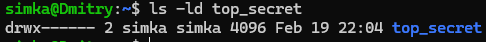
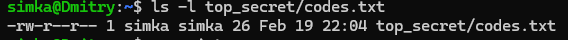
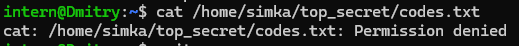
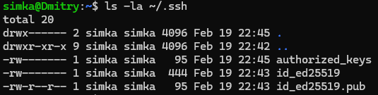

# HW Security №2

## 1.Вывод команды ls -ld top_secret

## 2.Вывод команды ls -l top_secret/codes.txt

## 3.Попытка чтения файла от имени пользователя intern (с ошибкой Permission denied).

## 4.Вывод команды ls -la ~/.ssh

